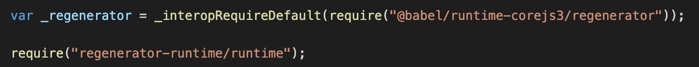

使用@babel/preset-env 简化配置，使用@babel/plugin-transform-runtime 避免全局污染并将内嵌方法换成模块引用的方式，减少代码体积。  
⚠️ 当@babel/plugin-transform-runtime 配置指定了 corejs=2/3，则不要使用@babel/preset-env 的 useBuiltIns=usage 选项，原因是@babel/plugin-transform-runtime 的 corejs 选项会将使用到的 polyfills 转成模块引用，@babel/preset-env 的 useBuiltIns=usage 选项又回根据使用到的特性引入对应的 polyfills，导致重复引用。

⚠️ @babel/plugin-transform-runtime 的 corejs=2/3 配置能够达到@babel/preset-env 的 useBuiltIns=usage 同样的效果，即只引入使用到的 polyfills，但通常最终打完的包体积前者会比后者大（猜测是 @babel/runtime-corejs3/** 的包本身比 core-js/modules/** 要大一些），所以不会受全局污染影响的项目推荐使用后者。
